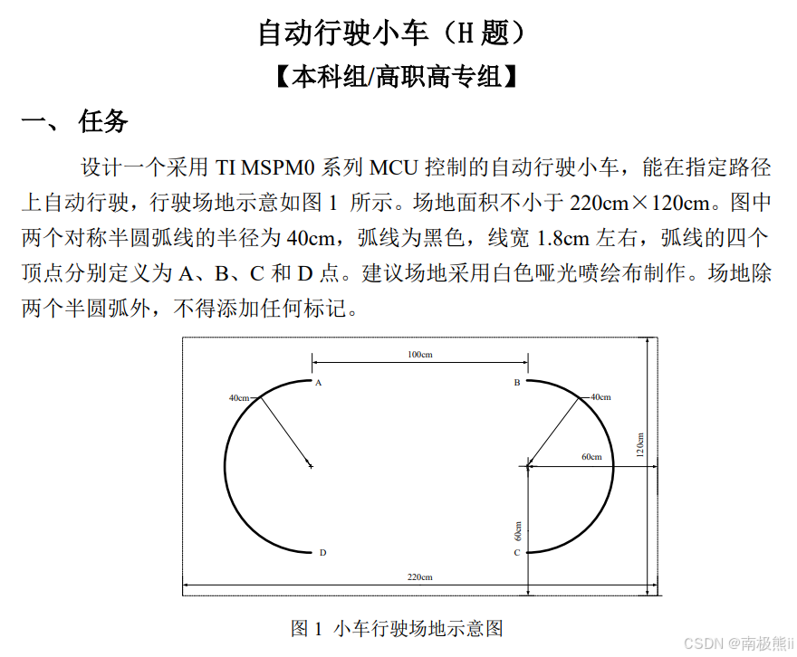

# 2026-dainsai-preparation-3507Car

基于 **TI MSPM0G3507** 的自动驾驶小车项目 — 2024 全国大学生电子设计竞赛 H 题赛前准备。

## 题目概述

白底黑线田径跑道场地，小车沿黑线循迹行驶，完成四条不同路径任务：

| Task | 路径 | 限时 |
|------|------|------|
| 1 | A→B 直线停车 | ≤15s |
| 2 | A→B→C→D→A 完整一圈 | ≤30s |
| 3 | A→C→B→D→A 交叉路径 | ≤40s |
| 4 | A→C→B→D→A ×4 圈 | 越短越好 |

约束：轮式小车、禁止后退、禁止摄像头、TI MSPM0 系列 MCU。



## 硬件

- **主控**：MSPM0G3507
- **传感器**：8 路灰度（循迹）、WIT JY61P 陀螺仪（航向/角速度）
- **执行**：直流电机 ×2（差速驱动）
- **显示**：OLED（I2C/SPI）
- **调试**：蓝牙串口日志

## 软件架构

```
main.c              # 主循环、按键选任务、Task_Run 分发
├── Task/task1-4.c  # 各任务状态机实现
├── Drivers/
│   ├── Grayscale/  # 8 路灰度传感器
│   ├── WIT/        # 陀螺仪（UART 解析 Yaw/gz）
│   ├── Motor/      # 电机 PWM 驱动
│   ├── OLED/       # OLED 显示
│   └── MSPM0/      # 时钟/中断初始化
└── doc/            # 设计文档
```

### 控制策略

- **直线段**：陀螺仪 Yaw 角 PID 锁定航向 + 编码器 PID 保持速度
- **弧线段**：灰度查表法 → 目标角速度 → 陀螺仪 gz PID 闭环
- **站点检测**：差异化判据（灰度黑线 / 全白），分任务分站点配置

## 开发环境

- **IDE**：Code Composer Studio Theia
- **SDK**：TI MSPM0 SDK + DriverLib
- **编译器**：TI Arm Clang

## 快速开始

1. 用 CCS Theia 导入项目
2. 打开 `mspm0-modules.syscfg` 确认外设配置
3. 编译下载到 MSPM0G3507
4. 上电后按键选择 Task 1-4，或通过调试器修改 `task_flag` 变量

## 参考资料

- [设计文档](doc/2026-07-12-自动驾驶小车-design.md)
- [项目说明](doc/2026-07-12-自动驾驶小车.md)
